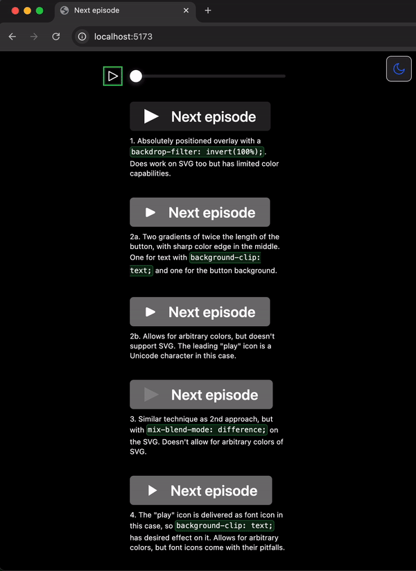

# Netflix "Next Episode" button



## Overview

This project explores how the Netflix "Next Episode" button animation could be created. The animation features a smooth color inversion effect that transitions from left to right, lasting 5 seconds. Several techniques were explored, including `backdrop-filter`, gradient overlays, `mix-blend-mode`, and font icons. Each method has its own strengths and limitations in terms of color flexibility and compatibility with different icon formats.

## Try it out

```shell
pnpm i
pnpm start
```

And that’s it, just a fun experiment to try some animation tricks.
